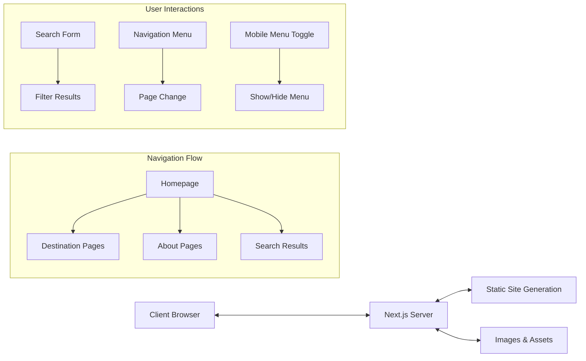
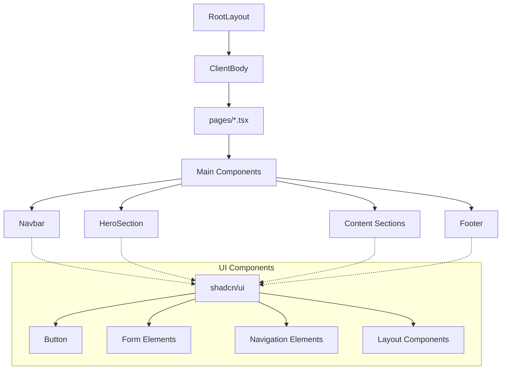

# SKR Reisen Website Structure

```mermaid
graph TD
    A[RootLayout - layout.tsx] --> B[ClientBody - ClientBody.tsx]
    B --> C[Home - page.tsx]

    C --> D[Navbar - Navbar.tsx]
    C --> E[HeroSection - HeroSection.tsx]
    C --> F[DestinationCategories]
    C --> G[PopularDestinations]
    C --> H[ClimateProtection]
    C --> I[Testimonials]
    C --> J[Footer]

    D --> D1[Logo]
    D --> D2[Desktop Navigation]
    D --> D3[Mobile Menu]

    D2 --> D2a[Main Menu Items]
    D2 --> D2b[Secondary Navigation]

    D2a --> D2a1[Dropdown Menus]

    E --> E1[Hero Image w/ Overlay]
    E --> E2[Title & Subtitle]
    E --> E3[Search Form]
    E --> E4[Ratings Display]

    E3 --> E3a[Destination Input]
    E3 --> E3b[Duration Select]
    E3 --> E3c[Search Button]

    F --> F1[Category Cards Grid]

    G --> G1[Section Title]
    G --> G2[Destination Cards]

    G2 --> G2a[Image]
    G2 --> G2b[Title]
    G2 --> G2c[Description]
    G2 --> G2d[Price/CTA]

    H --> H1[Icon/Image]
    H --> H2[Title]
    H --> H3[Description]

    I --> I1[Section Title]
    I --> I2[Testimonial Cards]

    I2 --> I2a[Quote]
    I2 --> I2b[Rating]
    I2 --> I2c[Customer Info]

    J --> J1[Company Info]
    J --> J2[Navigation Links]
    J --> J3[Contact Information]
    J --> J4[Social Media Links]
    J --> J5[Legal Links & Copyright]

    %% UI Components
    UI[UI Components] --> UI1[Button]
    UI --> UI2[Card]
    UI --> UI3[Dropdown Menu]
    UI --> UI4[Form Elements]
    UI --> UI5[Input]
    UI --> UI6[Sheet]
    UI --> UI7[Select]

    %% Styling
    S[Styling] --> S1[Tailwind CSS]
    S --> S2[Global CSS Variables]
    S --> S3[Custom Container Classes]
    S --> S4[Custom Button Classes]

    classDef clientComponent fill:#ffcccc,stroke:#ff0000
    classDef serverComponent fill:#ccffcc,stroke:#00ff00
    classDef uiComponent fill:#ccccff,stroke:#0000ff

    class B,D,E clientComponent
    class A,C,F,G,H,I,J serverComponent
    class UI,UI1,UI2,UI3,UI4,UI5,UI6,UI7 uiComponent
```

## Data Flow

## Component Hierarchy

## Legend
- Red Boxes: Client Components ('use client')
- Green Boxes: Server Components (default in Next.js App Router)
- Blue Boxes: UI Components (shadcn/ui library)
